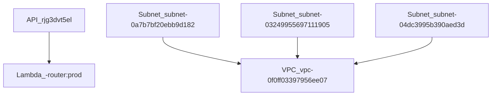

# AWS · Terraform-managed Resources

*Generated: 2025-07-25T14:51:44.266138Z*

## Account / Workspace

- **Account ID** → `108782059508`
- **Region** → `eu-central-1`
- **Workspace/Env** → `default`

---

## Compute · AWS Lambda

| Name | Runtime | Handler | Mem(MB) | Timeout(s) | Role ARN |
| --- | --- | --- | --- | --- | --- |
| tlfif-default-router | python3.12 | tinyllama.router.handler.lambda_handler | 512 | 30 | arn:aws:iam::108782059508:role/tlfif-default-router |

| Layer name | ARN |
| --- | --- |
| tlfif-default-shared-deps | arn:aws:lambda:eu-central-1:108782059508:layer:tlfif-default-shared-deps:6 |

## API Gateway HTTP APIs

### HTTP API · tlfif-default-router-api

- **API ID** → `rjg3dvt5el`
- **Invoke URL** → `https://rjg3dvt5el.execute-api.eu-central-1.amazonaws.com`

  • **Route** `POST /infer`
  • **Route** `GET /health`
  • **Route** `POST /stop`

## Networking

- **VPC ID** → `vpc-0f0ff03397956ee07`
- **CIDR** → `10.20.0.0/22`

| Subnet ID | CIDR | AZ |
| --- | --- | --- |
| subnet-0a7b7bf20ebb9d182 | 10.20.1.0/24 | eu-central-1a |
| subnet-03249955697111905 | 10.20.2.0/24 | eu-central-1a |
| subnet-04dc3995b390aed3d | 10.20.0.0/24 | eu-central-1a |

- **Internet Gateway** → `igw-0f41781d3afa0d1f1`
| Route Table ID | Name |
| --- | --- |
| rtb-0fc0f15fe6af2ebb1 | tinyllama-private-rt |
| rtb-0d45fb0b9f8747da8 | tinyllama-public-rt |

## Cognito

### aws_cognito_user_pool.main

- **Id** → `eu-central-1_I0PbLkQ2h`
- **Name** → `User pool - z-j4by`
- **Endpoint** → `cognito-idp.eu-central-1.amazonaws.com/eu-central-1_I0PbLkQ2h`

### aws_cognito_user_pool_client.gui

- **Id** → `5ee02s1pjn72oa5jv6vitcbgnk`
- **Name** → `tl-fif-desktop`

## SSM Parameters

| Terraform addr | SSM Param |
| --- | --- |
| aws_ssm_parameter.endpoint_url | /tinyllama/default/router_api_url |
| aws_ssm_parameter.client | /tinyllama/default/cognito_client_id |
| aws_ssm_parameter.pool | /tinyllama/default/cognito_user_pool_id |
| aws_ssm_parameter.global_ids | /tinyllama/default/cognito_client_id |
| aws_ssm_parameter.global_ids | /tinyllama/default/cognito_domain |
| aws_ssm_parameter.global_ids | /tinyllama/default/cognito_user_pool_id |
| aws_ssm_parameter.global_ids | /tinyllama/default/private_subnet_ids |
| aws_ssm_parameter.global_ids | /tinyllama/default/public_subnet_ids |
| aws_ssm_parameter.global_ids | /tinyllama/default/router_api_url |
| aws_ssm_parameter.global_ids | /tinyllama/default/vpc_id |

## IAM Roles

| Role | Trusted by | Attached/Inline |
| --- | --- | --- |
| tlfif-github-actions-deployer | arn:aws:iam::108782059508:oidc-provider/token.actions.githubusercontent.com | 0/1 |
| tlfif-default-router | lambda.amazonaws.com | 2/2 |
| tlfif-default-router | lambda.amazonaws.com | 2/2 |

## Observability (CloudWatch)

| Terraform addr | Name |
| --- | --- |
| aws_cloudwatch_log_group.router | /aws/lambda/tlfif-default-router |
| aws_cloudwatch_metric_alarm.p95_latency | tlfif-default-router-p95-latency |

## Dependency Map

- API rjg3dvt5el → Lambda -router:prod
- Subnet subnet-0a7b7bf20ebb9d182 → VPC vpc-0f0ff03397956ee07
- Subnet subnet-03249955697111905 → VPC vpc-0f0ff03397956ee07
- Subnet subnet-04dc3995b390aed3d → VPC vpc-0f0ff03397956ee07

